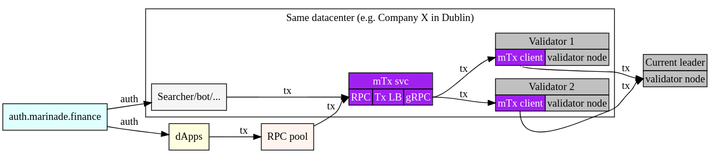

# mTransaction, priority transactions on Solana

## Open BETA on hold
This project is in an *open BETA* phase and currently on hold, so the service is not available for use. However, if you are a validator/dApp/Trader/whoever might benefit from using this project, reach out to us via [the validator signup](https://tally.so/r/mBEdAN) or [the searcher signup](https://tally.so/r/3xVMJk) and we will be happy to discuss any details with you and see how we could assist!

## What is mTransaction?
mTransaction is an RPC-like service that allows Solana users to send transactions to block-producers.
With QUIC coming to Solana, validators now have two connection pools: One is shared for transaction senders without stake, one is dedicated to transaction senders with stake.
Normal users who have no stake may have difficulties connecting to the block producer in times of network congestion.
mTransaction service utilizes stake of validators who choose to run `mtx-client`.
When a user wants to send a transaction, the user can send it to mTransaction service - the transaction is then forwarded to validators running `mtx-client` and then to the block-producer.
Block-producer is then more likely to accept incoming connection, because the connection uses the certificate of a staked validator and _should_ use the pool of guaranteed connections.
Unlike normal RPC services we only provide a single RPC method: `sendPriorityTransaction`.



## For validators
`mtx-client` is a thin gRPC client running on a validator node as a single binary side-car.
This client connects to the `mtx-server` and waits for transactions to be received.
This means that validators do not have to open any ports as the connection is initiated from their side to `mtx-server`.

There are two options when running the client:
1) Validator's identity is passed as an argument the `mtx-client`. `mtx-client` uses the identity to sign QUIC requests to block-producers.
No changes to how validator node runs are needed.
2) Validator enables `--rpc-port 8899 --full-rpc-api --private-rpc` on their node. (Validator should make sure that the RPC endpoint is only accessible from `127.0.0.1` and not from outside sources)
### Run MTX
To run `mtx-client` you need a certificate and `mtx-client` binary.
```bash
# Clone this repository
git clone https://github.com/marinade-finance/mtransaction

# Step into the directory
cd mtransaction

# If you want to build the `mtx-client` yourself:
# # Make sure you have the neccesary rust-specific dependencies:
# # 1) rust:
# curl --proto '=https' --tlsv1.2 -sSf https://sh.rustup.rs | sh
# # 2) Other rust develepment packages:
# sudo apt install make build-essential pkg-config libssl-dev
#
# # Install gRPC dependency
# sudo apt install protobuf-compiler
#
# # Build `mtx-client` (Or see latest release to download the binary)
# make build-client-release
#
# # Install `mtx-client`
# sudo cp ./target/release/mtx-client /usr/local/bin/mtx-client

# If you do not want to build `mtx-client` yourself, download it
sudo curl -LSfs 'https://github.com/marinade-finance/mtransaction/releases/download/v0.0.1-beta/mtx-client' -o /usr/local/bin/mtx-client
sudo chmod +x /usr/local/bin/mtx-client

# Generate certificate used by `mtx-client` to connect to `mtx-server`
# Replace IDENTITY by public key of your validator's identity
make cert-client cmd=req validator=<your_validator_identity_publickey>

# !!! IMPORTANT STEP
# Send ./certs/client.req to Marinade to have it signed by Marinade's certificate authority
# You should then receive `client.<your_validator_identity_publickey>.cert`

# Adjust privileges
chmod 0644 ./certs/client.*

# Install Marinade's `mtx-server` certificate
sudo curl -LSfs https://public.marinade.finance/mtx.ca.cert -o /etc/ssl/certs/mtx.ca.cert

# Setup systemd service file
cat <<EOF | sudo tee /lib/systemd/system/mtx-client.service
[Unit]
Description=MTX Client

[Service]
ExecStart=/usr/local/bin/mtx-client \\
  --tls-grpc-ca-cert     /etc/ssl/certs/mtx.ca.cert \\
  --tls-grpc-client-key  /<path to the repository>/certs/mtx.IDENTITY.key \\
  --tls-grpc-client-cert /<path to the repository>/certs/mtx.IDENTITY.cert \\
  --grpc-url             https://****.marinade.finance:50051 `# You will be assigned URL during onboarding` \\
  --tpu-addr             TPU_ADDR `# Only use with option 1); Replace TPU_ADDR by your public IP` \\
  --identity             /.../key.json `# Only use with option 1); Provide path to your identity`
# --rpc-url              http://127.0.0.1:8899 `# Only use with option 2)`

Restart=always
RestartSec=10s

[Install]
WantedBy=multi-user.target
EOF

# Reload systemd services
sudo systemctl daemon-reload

# Enable mtx service on reboot
sudo systemctl enable mtx-client

# Start mtx service
sudo service mtx-client start

# Observe logs
sudo journalctl -u mtx-client -f
```

## For transaction senders
Proper authentication/billing/... will be added later and this service is now provided for free to users of our open beta.
If you are interested in trying this service, reach out to us on discord.

### Send transaction
```bash
curl RPC_URL -X POST -H "Content-Type: application/json" -H "Authorization: Bearer ***" -d '{
  "jsonrpc": "2.0",
  "method": "sendPriorityTransaction",
  "id": 1,
  "params": ["ARshF1FLgiVW50Ni22v0MvVwbG+lzVF3Lny0RXdel49BaJ+h7CD3SsAA2611yJgrzywPPoH61NqEVnEamW8d2ggBAAEDB0RIKu9gtXbw72njHgZGjO2GvCj5asjUDjoWRvAjtgVSd+bmVQdeIet9vYadHhwEFFONs9iJcGGojpal6ubMaQAAAAAAAAAAAAAAAAAAAAAAAAAAAAAAAAAAAAAAAAAA0zi3p2jurWfGuUPD/3Ny0mYgNYCpRQhozRYVCJdLYzkBAgIAAQwCAAAARQAAAAAAAAA="]
}'
```
```js
const tx = new web3.Transaction(...).add(...)
await tx.sign(...)
await fetch(..., {
  method: 'post',
  body: JSON.stringify({
    jsonrpc: '2.0',
    method: 'sendPriorityTransaction',
    id: 1,
    params: [Buffer.from(tx.serialize()).toString('base64')],
  }),
  headers: { 'Content-Type': 'application/json', Authorization: 'Bearer ***' }
})
```

## For developers
Before building the rust binaries, you need (apart from rust toolchain):
```bash
# Ubuntu
sudo apt install -y protobuf-compiler libprotobuf-dev

# Alpine
apk add protoc protobuf-dev

# MacOS
brew install protobuf
```

Useful commands:
```bash
# Prepare local CA
make cert-server cmd=ca
make cert-server cmd=sign host=localhost

# Sign client certificate request
make cert-client cmd=sign
```
